He realizado, junto con el instructor, el proyecto final de la formación MySQL aplicando todo lo enseñado en los cursos. El proyecto consiste en crear una base de datos (schema) llamada **empresa** en MySQL con 5 tablas las cuales se denominan como: **vendedores**, **clientes**,**facturas**,**productos** y **items**. Las cuatro primeras tablas son tablas de dimensiones y la última es una tabla de hechos. El esquema se denomima Snowflake y el diagrama entidad-relación de dicho schema en el cual se muestra cada entidad con sus atributos y su tipo de datos se puede ver a continuación:

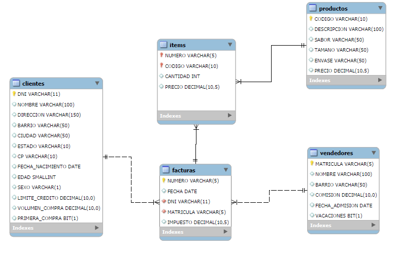

Una vez creado el schema en MySQL se debe crear lo siguiente:

> Dada una fecha, dado un número máximo de items (líneas) que pueda contener una factura
> y dado un número máximo de productos para cada item, crear una nueva factura, en la tabla de facturas, que contenga items de productos tomados de manera aleatoria desde la tabla de productos y crear dichos items asociados a dicha factura, en la tabla de items, con una cantidad de producto igual a un número aleatorio entre 1 y el número maximo dado como cantidad de productos, número que fue dado como requisito.

Para resolver lo anterior, se crea el **stored procedure** llamado sp_venta siguiente:

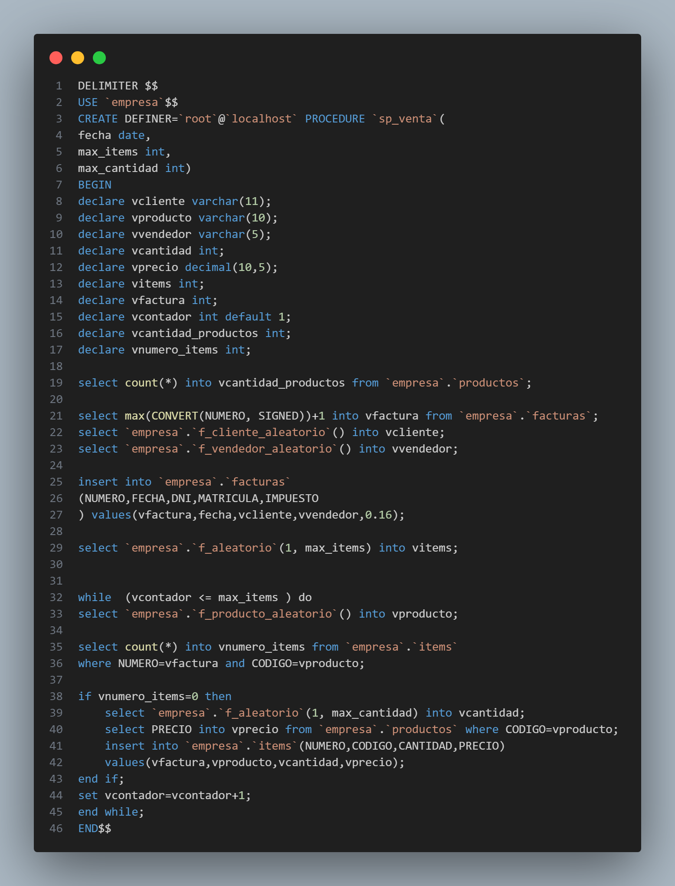

Dicho procedure toma tres parámetros que se corresponden con la data dada en el problema: fecha, maximo de items y máxima cantidad de productos para cada item. Como se puede observar en el diagrama entidad-relación, para crear una nueva factura en la tabla de facturas debo tener lo siguiente:

1-Un número nuevo, distinto a todos los otros números registrados en la columna NUMERO ya que dicha columna es clave primaria.

2-Una FECHA, dicha fecha corresponde con el parámetro dado en el procedure.

3-Un DNI, el cual es clave foránea en la tabla de facturas de la clave primaria de la tabla de clientes.

4-Una MATRICULA, la cual es clave foránea en la tabla de facturas de la clave primaria de la tabla de vendedores.

5-Un IMPUESTO del tipo de dato DECIMAL.

Para lograr insertar una nueva factura en la tabla de facturas se realiza lo siguiente para cada campo:

1-Se toma el número mayor de la columna de facturas y se le suma uno a dicho valor. Como dicha columna almacena números como cadena de texto, se procede a realizar la conversión a entero de dicha columna para luego proceder a calcular su número:

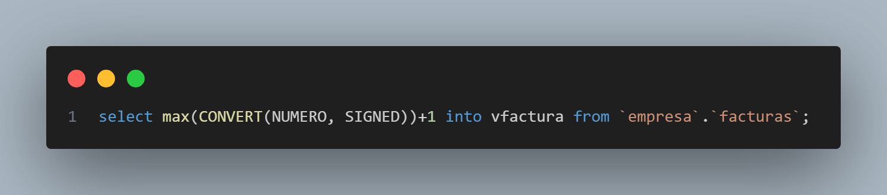

2-La fecha corresponde al parámetro que se le pasa al procedure.

3-El DNI se selecciona de manera aleatoria desde la tabla de clientes. Para seleccionar un número aleatorio en un rango de valores definido con un valor mínimo y máximo se procede a crear la siguiente función:

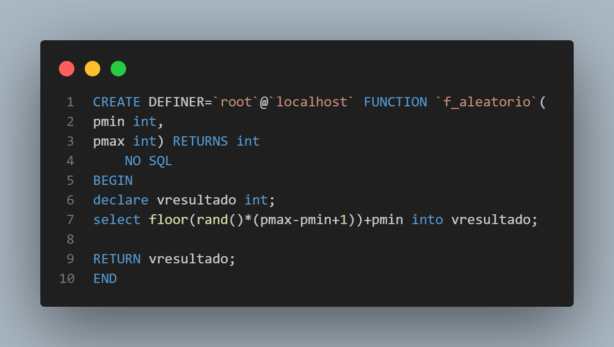

Luego de creada dicha función se procede a crear otra función que permite retornar un DNI de un cliente aleatorio desde la tabla de clientes. Dicha función es la siguiente:

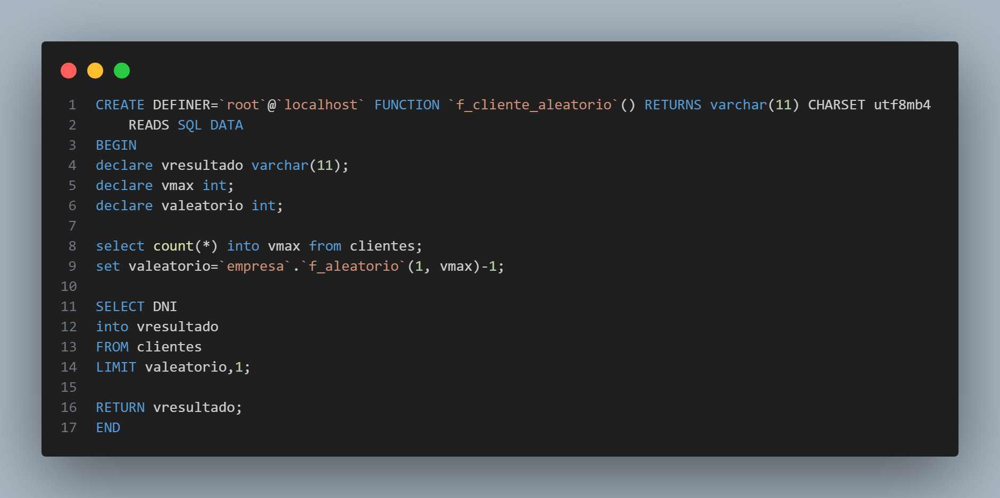

Una vez creada dicha función, se utiliza para almacenar dicho DNI en la variable **vcliente**:

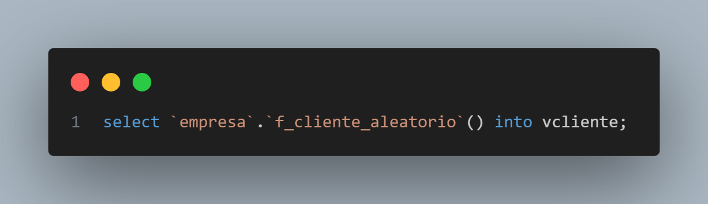

4-La MATRICULA, se selecciona de manera aleatoria desde la tabla de vendedores utilizando la siguiente función que retorna un número de MATRICULA aleatorio:

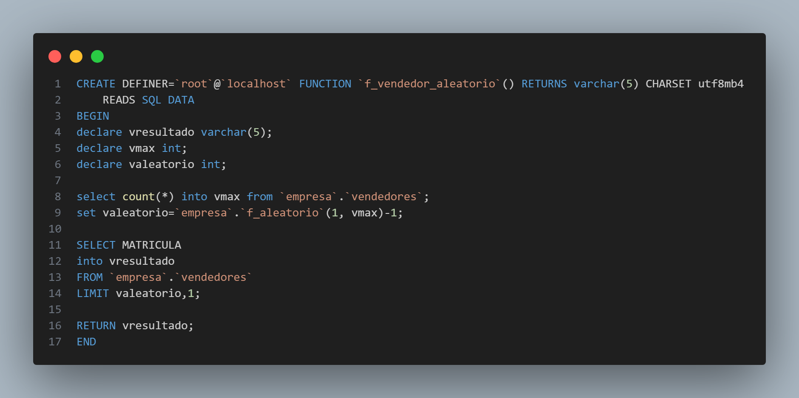

En el procedure se utiliza dicha función para retornar un número de MATRICULA aleatorio desde la tabla de vendedores, valor que se almacena en la variable **vvendedor**:

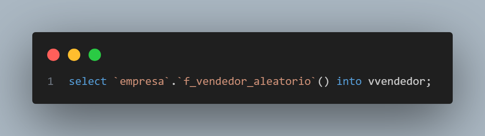

5-Se utilizan un valor de IMPUESTO fijo de 0.16.

Obtenidos todos los nuevos campos se procede a insertar esta nueva factura en la tabla de facturas mediante el siguiente código:

Insertado la nueva factura se procede a insertar nuevos items a dicha factura. Los items se almacenan en la tabla items y estan ligados a la factura que pertenecen mediante una clave foránea. Para insertar nuevos items para la factura recién creada, se observa que la tabla de items posee 4 campos: NUMERO, CODIGO, CANTIDAD, PRECIO y que para insertar un nuevo item debo dar valores a cada registro que se corresponda con cada uno de dichos campos para lo cual se realiza lo siguiente:

1- NUMERO: el campo número es clave foránea en la tabla de items de la clave primaria de la tabla de facturas. Dicho valor fue obtenido en el punto 1 anterior cuando se creo una nueva factura siendo este el número máximo más 1 de la columna NUMERO de la tabla de facturas.

2-CODIGO: el campo código es clave foránea en la tabla de items de la clave primaria de la tabla de productos. Dicho código se toma de manera aleatoria desde dicha tabla por medio de la siguiente función:

Dicha función retorna un código aleatorio que se almacena en la variable **vproducto**:

3-CANTIDAD: la cantidad se crea obteniendo un número aleatorio entre 1 y el número máximo de cantidad dado como parámetro en el procedure:

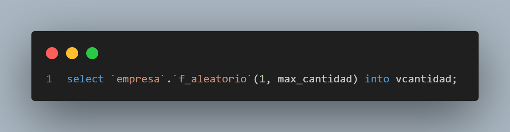

4-PRECIO: el campo precio se encuentra en la tabla de productos y dicho campo se obtiene utilizando el valor del producto seleccionado de manera aleatoria en base al siguiente código:

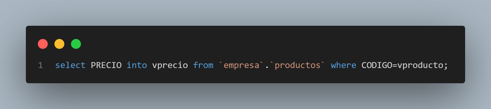

Lo anterior se puede realizar ya que el valor aleatorio obtenido de la tabla de productos pertenece a la columna CODIGO la cual es clave primaria de dicha tabla de productos.

Listo los 4 campos requeridos para insertar un nuevo item en la tabla de items, necesito insertar un número igual o menor al valor dado como parámetro del procedure el cual se nombro como **max_items**. Para ir insertando registros de manera iterativa hasta el número dado por la variable **max_items** se crea un ciclo while el cual utiliza un contador que se va actualizando:

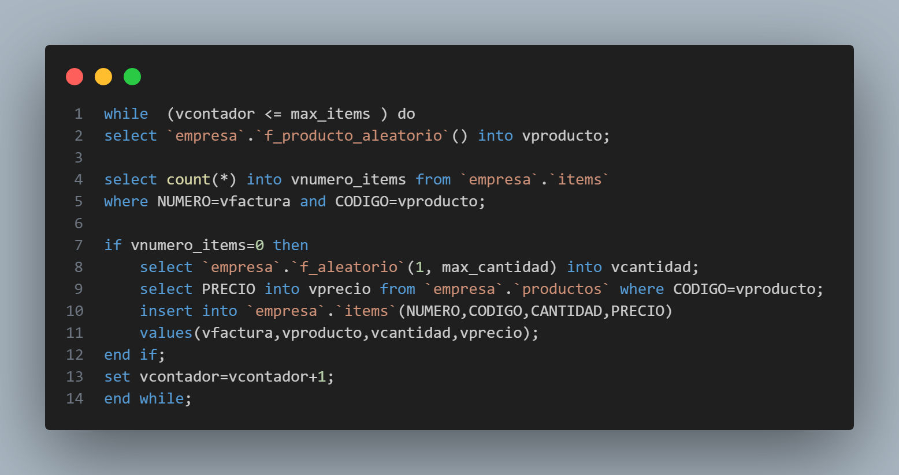

Este ciclo while tiene en su cuerpo una condición que permite no ingresar un nuevo item cuando ya esta presente en la tabla de items. Para realizar lo anterior se crea el siguiente código que almacena el número de registros retornados al consultar la tabla de items para la clave primaria dada por los campos NUMERO y CODIGO:

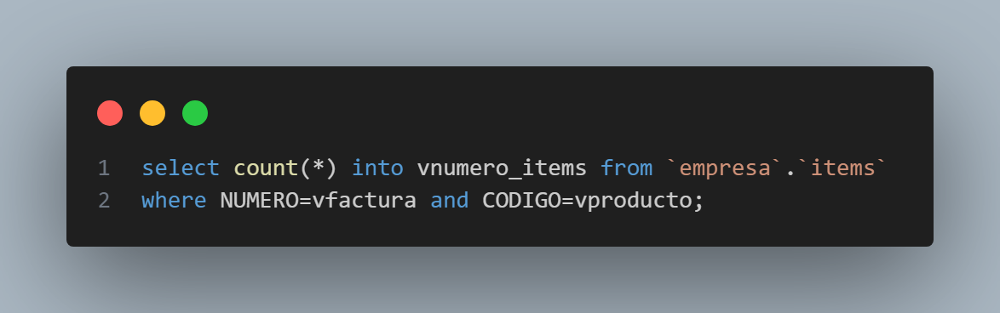

Dicho valor se almacena en la variable **vnumero_items**. Posteriormente, se realiza la inserción de un nuevo registro en la tabla de items solo cuando la nueva clave primaria generada en la tabla de items de manera aleatoria no esta presente en dicha tabla y para ello se crea el condicional IF siguiente:

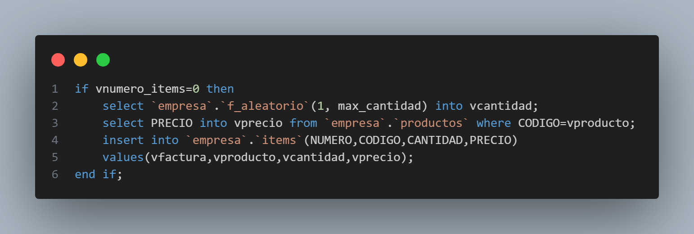

Si se generan valores aleatorios para la clave primaria de la tabla de items repetidos se salta dicha iteración en el ciclo while y se continua con la siguiente hasta ser mayor al número máximo de items, variable dada como parámetro al comienzo del procedure.

### Ejecución del procedure

Dicho procedure lo he ejecutado con los siguientes argumentos:

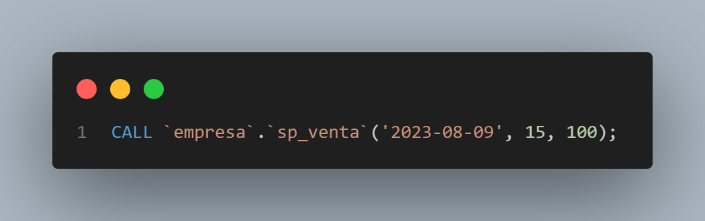

Para verificar la ejecución exitosa del procedure y la creación de los nuevos registros ejecuto la siguiente consulta:

A continuación se muestra el resultado de la consulta SQL:

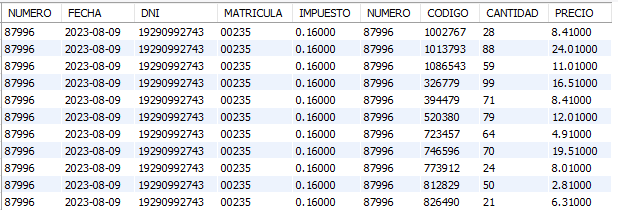

Como se puede observar se ha creado una nueva factura con 11 items siendo que el número máximo de items a crear que se le paso como argumentos al procedure fue de 15 lo que implica que 4 CODIGOS de items fueron generados de manera repetida y que hicieron continuar al bucle while sin insertar registros a la tabla de items.

### Creación de Triggers para UPDATE,DELETE, INSERT en la tabla de items

Se desea crear una nueva tabla que tenga una columna con el campo fecha de la tabla de facturas junto con la venta total para cada día. Para ello se crea la tabla con el siguiente código SQL:

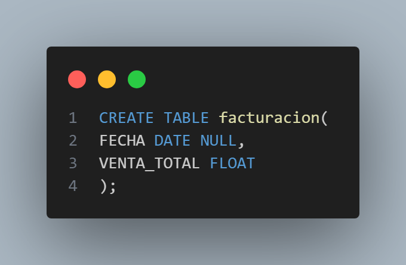

Posteriormente, se ejecuta el siguiente procedimiento llamado **sp_triggers** dentro de cada uno de los triggers:

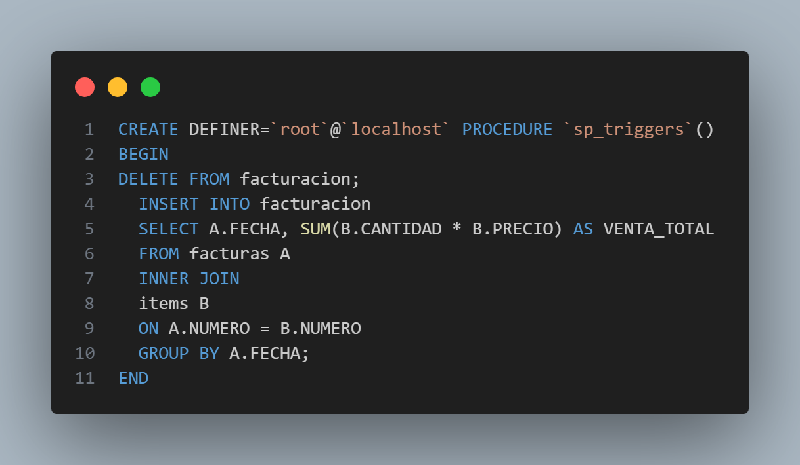

Dicho procedimiento borra todos los registros de la tabla resumen y procede a poblarla con nueva data cuando se gatilla un evento de inserción, borrado o actualización sobre la tabla de items. A continuación se muestra cada uno de los triggers que llaman dicho procedimiento llamado **sp_triggers** en el cuerpo de cada trigger:

#### Trigger Update

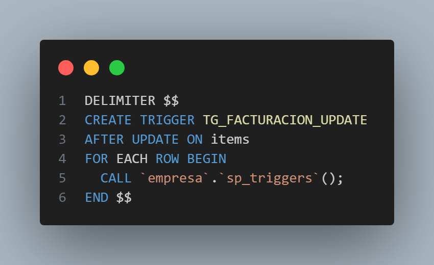

#### Trigger Insert

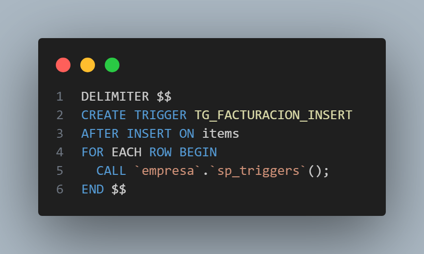

#### Trigger Delete

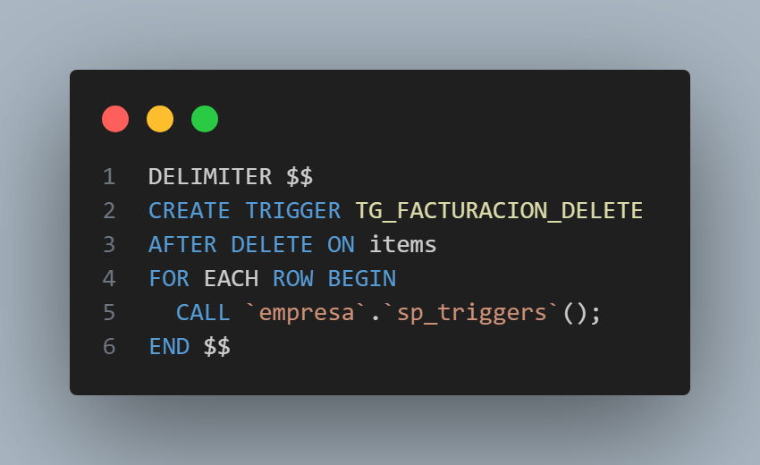

Si ejecuto el procedure de creación de una nueva factura e items para una nueva fecha como muestro a continuación:

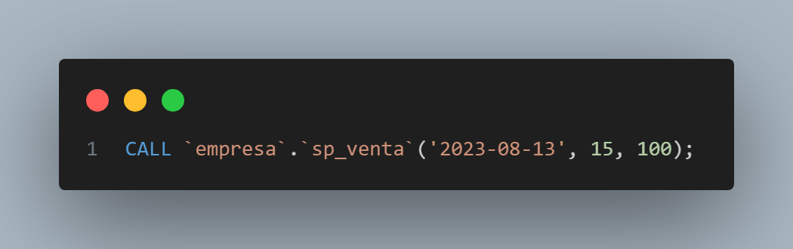

Se observa que la creación ha sido exitosa mediante la siguiente consulta:

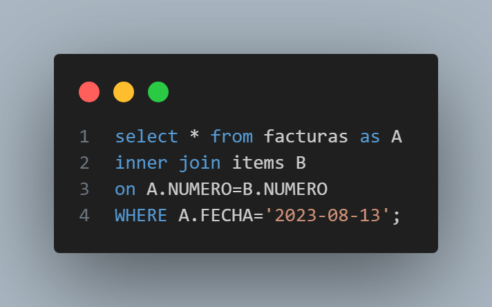

A continuación muestro el output de dicha consulta:

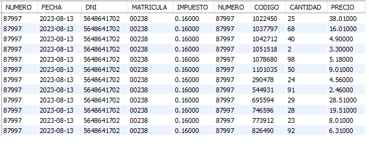

Al consultar en la tabla de resumen para esa fecha de creación de factura e items mediante la siguiente consulta:

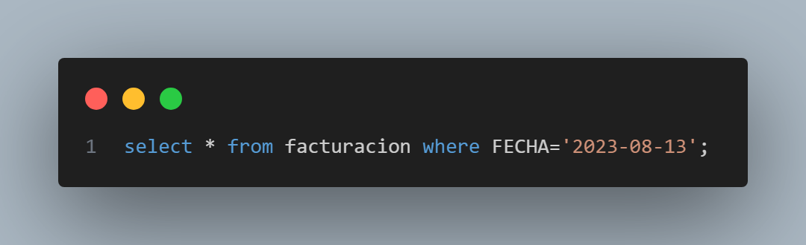

Lo que arroja el siguiente output:

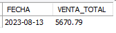

Es decir, como se ha modificado la tabla de items mediante la creación de nuevos items para una nueva factura se gatillan los triggers que actualizan la tabla de resumen y el output es el que acabo de mostrar observándose que todo funciona tal y como se ha querido.
